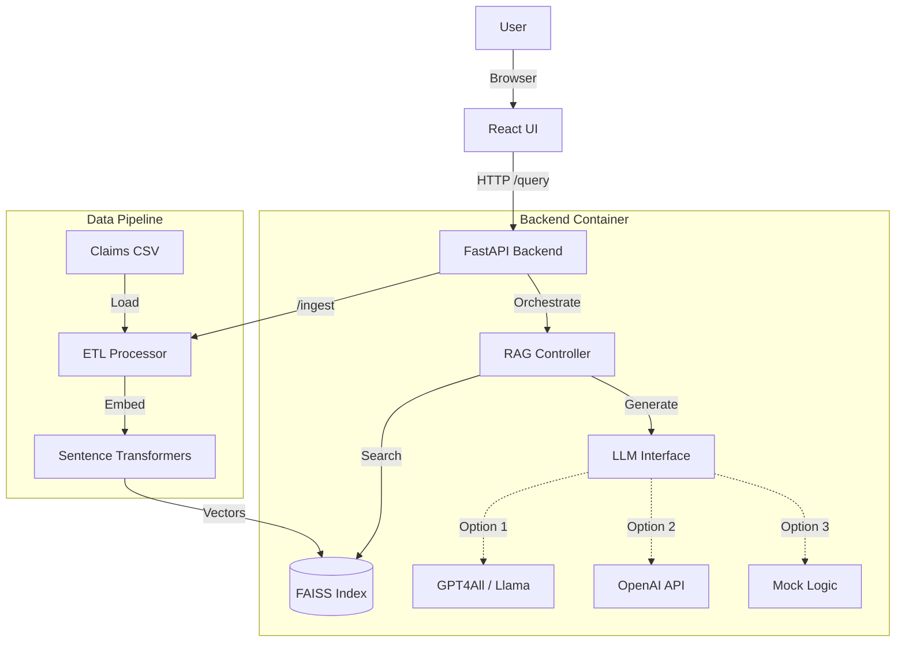

# System Architecture

## Components
1. **Frontend**: Simple Chat UI to send queries and display answers + sources.
2. **Backend**: 
   - **FastAPI**: Handles requests.
   - **RAG Engine**: Retrieves documents based on semantic similarity.
   - **LLM**: Generates human-readable answers.
3. **Data**: 
   - **Synthetic Generator**: Creates realistic claims data.
   - **FAISS**: Stores embeddings for fast retrieval.

## Tradeoffs & Decisions
- **Local FAISS vs Cloud Vector DB**: Chosen local FAISS for simplicity and "run anywhere" requirement. For 5k rows, FAISS is sub-millisecond. For 100M rows, use Milvus.
- **Sync Ingestion**: Ingestion is synchronous on `/ingest`. For production, this should be a background Celery task.
- **Mock LLM Default**: To ensure the demo works without downloading 5GB models on start, default is Mock. User can switch to `gpt4all` via env var.
